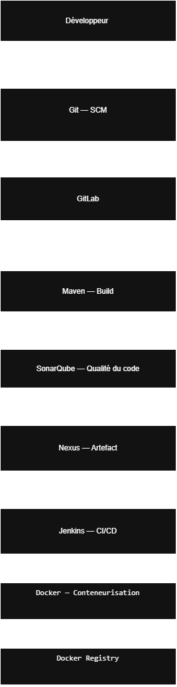

# CI-Lab — Mise en place d'une chaîne CI/CD

## 1. Présentation du projet

Ce projet consiste à mettre en place une chaîne complète d'intégration continue et de déploiement continu (CI/CD) pour automatiser le cycle de vie d'une application.

L'objectif est de mettre en œuvre les différentes étapes allant du développement du code jusqu'à la construction, l'analyse, la gestion des artefacts, la conteneurisation et l'automatisation du déploiement.

---

## 2. Architecture globale

L'architecture mise en place repose sur les outils suivants :

**Développeur → Git → GitLab → Maven → SonarQube → Nexus → Jenkins → Docker → Docker Registry**

### Schéma d'architecture



Le fichier source de l'architecture est disponible ici :

* `architecture/01-global-architecture.drawio`

L'image PNG permet de visualiser directement l'architecture, tandis que le fichier Draw.io permet de modifier le schéma.

---

## 3. Technologies utilisées

| Technologie     | Rôle                                               |
| --------------- | -------------------------------------------------- |
| Git             | Gestion du code source                             |
| GitLab          | Hébergement du dépôt Git et gestion du code source |
| Maven           | Compilation et construction de l'application Java  |
| SonarQube       | Analyse de la qualité et du code source            |
| Nexus           | Stockage et gestion des artefacts                  |
| Jenkins         | Automatisation du pipeline CI/CD                   |
| Docker          | Conteneurisation de l'application                  |
| Docker Registry | Stockage et distribution des images Docker         |

---

## 4. Flux CI/CD

Le fonctionnement global de la chaîne est le suivant :

### Étape 1 — Développement

Le développeur modifie le code source de l'application.

### Étape 2 — Gestion du code source

Le code est versionné avec **Git** et hébergé sur **GitLab**.

### Étape 3 — Build

**Maven** est utilisé pour compiler l'application et générer le package nécessaire au déploiement.

### Étape 4 — Analyse de qualité

**SonarQube** analyse le code afin d'identifier les problèmes de qualité, les bugs potentiels et les vulnérabilités.

### Étape 5 — Gestion des artefacts

L'artefact généré par Maven est envoyé vers **Nexus Repository** afin d'être stocké et versionné.

### Étape 6 — Pipeline CI/CD

**Jenkins** orchestre les différentes étapes du pipeline et automatise l'exécution des tâches.

### Étape 7 — Conteneurisation

Une image **Docker** est construite à partir de l'application.

### Étape 8 — Docker Registry

L'image Docker est envoyée vers un **Docker Registry** afin d'être stockée et utilisée pour les déploiements.

---

## 5. Structure du projet

```text
CI-Lab/
│
├── architecture/
│   ├── 01-global-architecture.drawio
│   └── 01-global-architecture.png
│
├── screenshots/
│   └── 03-git/
│       └── .gitkeep
│
└── README.md
```

---

## 6. Objectifs

Les principaux objectifs de ce projet sont :

* Mettre en place une chaîne CI/CD complète.
* Automatiser la compilation de l'application.
* Automatiser l'analyse de la qualité du code.
* Centraliser les artefacts générés.
* Automatiser la construction des images Docker.
* Publier les images dans un Docker Registry.
* Comprendre le fonctionnement d'un pipeline CI/CD de bout en bout.

---

## 7. Pipeline CI/CD

Le pipeline global peut être représenté comme suit :

```text
Développeur
     │
     ▼
    Git
     │
     ▼
   GitLab
     │
     ▼
   Maven
     │
     ▼
 SonarQube
     │
     ▼
   Nexus
     │
     ▼
  Jenkins
     │
     ▼
   Docker
     │
     ▼
Docker Registry
```

---

## 8. Résultat attendu

À la fin du projet, le processus de livraison doit être automatisé :

**Modification du code → Commit → Build → Analyse → Publication de l'artefact → Construction de l'image Docker → Publication de l'image**

Cette chaîne permet d'améliorer la fiabilité, la reproductibilité et la rapidité du processus de livraison logicielle.

---

## 9. Captures d'écran

Les captures d'écran du projet seront ajoutées progressivement dans le dossier :

```text
screenshots/
```

Elles permettront de documenter les différentes étapes de mise en place de la chaîne CI/CD.

---

## 10. Conclusion

Ce projet permet de mettre en pratique les principaux concepts DevOps liés à l'intégration continue, à la gestion des artefacts, à la qualité du code, à la conteneurisation et à l'automatisation des processus de livraison.
